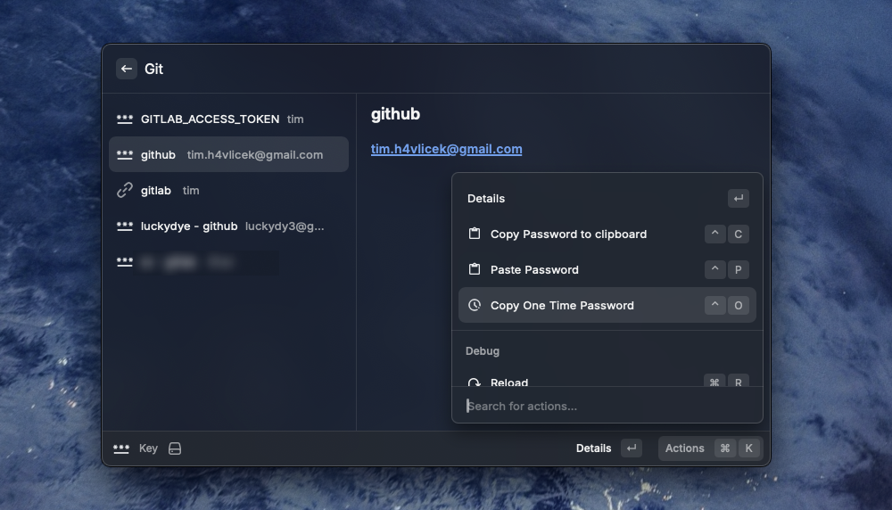

# key

## Command Line Utility

```
Cli to a local or remote keepass database

Usage: key [OPTIONS] [COMMAND]

Commands:
  otp     Generate a One time password
  gen     Generate a new password
  list    List all entries of the database
  get     Get a specific entry from the database
  set     Set the value of a specific entry in the database
  delete  Delete a specific entry from the database
  rename  Rename a specific entry in the database
  choose  Chooser terminal ui
  help    Print this message or the help of the given subcommand(s)

Options:
  -k, --keyfile <KEYFILE>              Path to the keyfile [env: KEY_KEYFILE]
      --kdbx <KDBX>                    Url to the keepass database file (supports file:// and s3:// schemas) [env: KEY_DATABASE_URL]
  -p, --password <PASSWORD>            Database password [env: KEY_PASSWORD]
      --s3-access-key <S3_ACCESS_KEY>  S3 access key [env: KEY_S3_ACCESS_KEY]
      --s3-secret-key <S3_SECRET_KEY>  S3 secret key [env: KEY_S3_SECRET_KEY]
  -h, --help                           Print help
  -V, --version                        Print version
```

## Raycast extension



## Desktop App

Coming soon

## Mobile App

Coming soon
